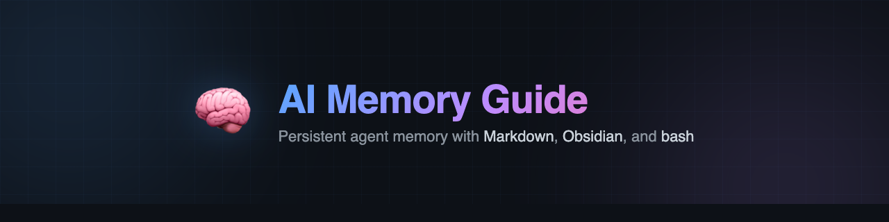

<p align="center">
  
</p>

<p align="center">
  <strong>A practical guide to building persistent AI agent memory with structured Markdown.</strong>
</p>

<p align="center">
  <a href="LICENSE"></a>
  
  
  
  
</p>

<p align="center">
  <a href="#quick-start">Quick Start</a> •
  <a href="#how-it-works">How It Works</a> •
  <a href="#comparison">Comparison</a> •
  <a href="#chapters">Chapters</a> •
  <a href="#scripts">Scripts</a> •
  <a href="#roadmap">Roadmap</a> •
  <a href="#contributing">Contributing</a>
</p>

---

## The Problem

Every AI agent has the same problem: **amnesia**.

You explain your project, set up context, make decisions — next session it's all gone. Context compaction silently destroys hours of accumulated knowledge.

This guide shows a **middle path** between a bloated single file and over-engineered vector databases: a structured, human-readable memory system using tools you already have.

> Born from building and maintaining a real agent vault (~60 files, daily use). Opinionated, practical, open source.

<p align="right">(<a href="#the-problem">back to top</a>)</p>

---

## How It Works

```
┌─────────────────────────────────────────────┐
│              AGENT RUNTIME                   │
│  ┌──────────────────────────────────────┐    │
│  │ SOUL.md · USER.md · AGENTS.md       │    │
│  │ MEMORY.md (auto-generated index)     │    │
│  │ CONTEXT.md (current state)           │    │
│  │ Today's journal                      │    │
│  └──────────────────────────────────────┘    │
└──────────────────┬──────────────────────────┘
                   │ read/write
                   ▼
┌─────────────────────────────────────────────┐
│          PERSISTENT MEMORY (disk)            │
│  memory/                                     │
│  ├── journal/       ← daily logs             │
│  ├── decisions/     ← decisions + rationale  │
│  ├── threads/       ← open discussions       │
│  ├── tasks/         ← active + backlog       │
│  ├── knowledge/     ← entities, narratives   │
│  ├── predictions/   ← tracked predictions    │
│  ├── lessons/       ← post-mortems           │
│  └── preferences/   ← user preferences       │
│                                              │
│  All files: YAML frontmatter + wikilinks     │
└──────────────────┬──────────────────────────┘
                   │ browse / edit
                   ▼
┌─────────────────────────────────────────────┐
│           OBSIDIAN (optional)                │
│  Graph View · Dataview · Templater · Git     │
└─────────────────────────────────────────────┘
```

**The loop:** Agent searches memory → reads relevant files → responds with context → writes new knowledge back (write-through). Nothing is deferred. Nothing is lost.

<p align="right">(<a href="#the-problem">back to top</a>)</p>

---

## Quick Start

**1. Create the structure**

```bash
bash scripts/setup.sh
```

**2. Add frontmatter to every file**

```yaml
---
title: "Delay DB Migration"
created: 2026-02-20
type: decision
tags: [database, v2]
---
```

**3. Link everything with wikilinks**

```markdown
This relates to [[db-migration]] and affects the [[v2-release]] timeline.
```

**4. Open `memory/` in Obsidian** — see your knowledge graph come alive.

**5. Run health checks**

```bash
bash scripts/memory-health.sh          # 10-point health check
bash scripts/generate-memory-index.sh  # regenerate MEMORY.md
bash scripts/check-wikilinks.sh        # find broken links
```

<p align="right">(<a href="#the-problem">back to top</a>)</p>

---

## Example

**User:** *"What did we decide about the database migration?"*

```
1. Agent runs memory_search("database migration decision")
   → finds decisions/2026-02-10-db-migration-delayed.md

2. Reads the file
   → "Postponed until v2.0 — waiting on test coverage reaching 80%"

3. Responds with context + citation
   → "On Feb 10 we decided to postpone until v2.0. Still in effect."

4. Writes to today's journal (write-through)
   → "Revisited db-migration-delayed — still valid"
```

**Without this system:** *"I don't have context about the migration. Can you remind me?"*

→ [Full walkthrough →](docs/12-example-workflow.md)

<p align="right">(<a href="#the-problem">back to top</a>)</p>

---

<a id="comparison"></a>

## How This Compares

| | This Guide | Single MEMORY.md | Mem0 / Cloud | Vector DB (Qdrant, Pinecone) |
|---|:---:|:---:|:---:|:---:|
| **Setup time** | 5 min | 0 min | 10 min | 30+ min |
| **Dependencies** | bash, yq | none | cloud account | Python, Docker, embeddings model |
| **Human-readable** | ✅ Markdown | ✅ Markdown | ❌ API only | ❌ Embeddings |
| **Survives compaction** | ✅ | ⚠️ Gets bloated | ✅ | ✅ |
| **Knowledge graph** | ✅ Obsidian | ❌ | ❌ | ❌ |
| **Health checks** | ✅ Scripts | ❌ | ❌ | ❌ |
| **Vendor lock-in** | ❌ None | ❌ None | ⚠️ Cloud | ⚠️ Infra |
| **Cost** | Free | Free | $$ | $ (self-host) |
| **Best for** | 10–500 files | < 10 files | Multi-agent cloud | 500+ files, semantic search |

<p align="right">(<a href="#the-problem">back to top</a>)</p>

---

<a id="chapters"></a>

## Chapters

| # | Topic | |
|---|-------|-|
| 1 | [The Problem: AI Amnesia](docs/01-the-problem.md) | Why agents forget and why context windows aren't enough |
| 2 | [Architecture: 3-Layer Memory](docs/02-architecture.md) | Hot, warm, and cold memory layers |
| 3 | [File Structure & Naming](docs/03-file-structure.md) | Conventions that scale |
| 4 | [Frontmatter & Metadata](docs/04-frontmatter.md) | YAML schema for every file type |
| 5 | [Wikilinks & Knowledge Graph](docs/05-wikilinks.md) | Connecting knowledge with `[[links]]` |
| 6 | [Write-Through Protocol](docs/06-write-through.md) | Rules that ensure nothing gets lost |
| 7 | [Continual Learning Loop](docs/07-continual-learning.md) | How the agent gets smarter over time |
| 8 | [Obsidian Integration](docs/08-obsidian.md) | Graph view, Dataview queries, plugins |
| 9 | [Anti-Amnesia Patterns](docs/09-anti-amnesia.md) | Surviving compaction and session switches |
| 10 | [Maintenance Scripts](docs/10-scripts.md) | Automated health checks and index generation |
| 11 | [Advanced: Semantic Search](docs/11-advanced.md) | When and how to add embeddings |
| 12 | [Example: End-to-End Workflow](docs/12-example-workflow.md) | Complete walkthrough with a real scenario |
| 13 | [OpenClaw Integration](docs/13-openclaw-integration.md) | Platform-specific setup guide |

**Appendices:** [Templates](templates/) · [Scripts](scripts/) · [Research & Sources](docs/research.md)

<p align="right">(<a href="#the-problem">back to top</a>)</p>

---

## Scripts

Real, working bash scripts — not pseudocode:

| Script | What it does |
|--------|-------------|
| [`setup.sh`](scripts/setup.sh) | Creates the full `memory/` directory structure |
| [`generate-memory-index.sh`](scripts/generate-memory-index.sh) | Auto-generates `MEMORY.md` from frontmatter |
| [`memory-health.sh`](scripts/memory-health.sh) | 10-point health check with pass/fail scoring |
| [`check-wikilinks.sh`](scripts/check-wikilinks.sh) | Finds broken `[[wikilinks]]` across all files |

**Requirements:** `bash` + [`yq`](https://github.com/mikefarah/yq) (`brew install yq` / `apt install yq`)

```bash
$ bash scripts/memory-health.sh

🧠 Memory Health Report — 2026-02-20 08:30

✅ Frontmatter:    52/52 files OK
✅ Orphans:        0 files without backlinks
✅ Missing links:  0 broken wikilinks
✅ Stale files:    0 files > 30 days
✅ Empty files:    0 critically empty files
✅ Duplicates:     0 duplicate titles
✅ MEMORY.md:      285 words (< 2500)
✅ CONTEXT.md:     2h old
✅ Journal:        2026-02-20 entry exists
✅ MOC:            Master MOC exists

Score: 10/10 (100%) — ✅ HEALTHY
```

<p align="right">(<a href="#the-problem">back to top</a>)</p>

---

## Principles

| # | Principle | Why |
|---|-----------|-----|
| 1 | **Human-readable first** | All memory is Markdown. You can read, edit, grep it. |
| 2 | **No vendor lock-in** | No cloud services. Everything local. |
| 3 | **Write-through** | Save immediately, not "later". Deferred writes = lost data. |
| 4 | **Structured but simple** | YAML frontmatter + wikilinks. That's the whole stack. |
| 5 | **Verify, don't trust** | Health checks catch drift before it becomes a problem. |

<p align="right">(<a href="#the-problem">back to top</a>)</p>

---

<a id="roadmap"></a>

## Roadmap

- [x] 13 chapters covering full memory architecture
- [x] 4 working bash scripts
- [x] 9 file templates
- [x] Obsidian configuration + plugin recommendations
- [x] OpenClaw integration guide
- [ ] More platform guides (Claude Code, Cursor, Windsurf)
- [ ] Example vault with sample data you can clone
- [ ] Video walkthrough
- [ ] Community patterns & templates gallery

See [open issues](https://github.com/Qu4ntking/ai-memory-guide/issues) for feature requests.

<p align="right">(<a href="#the-problem">back to top</a>)</p>

---

<a id="contributing"></a>

## Contributing

Contributions make open source great. Any contribution is **appreciated**.

1. Fork the repo
2. Create a branch (`git checkout -b feature/my-improvement`)
3. Commit your changes (`git commit -m 'Add: new pattern for X'`)
4. Push (`git push origin feature/my-improvement`)
5. Open a Pull Request

**Ideas for contributions:**
- New anti-amnesia patterns
- Integration guides for other platforms
- Translations
- Script improvements
- Real-world case studies

<p align="right">(<a href="#the-problem">back to top</a>)</p>

---

## Who Is This For

- **AI agent builders** who want persistent memory without infrastructure overhead
- **[OpenClaw](https://github.com/openclaw/openclaw) users** — dedicated [integration guide](docs/13-openclaw-integration.md)
- **Obsidian users** who want their AI to use their vault as a knowledge base
- **Anyone** tired of repeating themselves to their AI assistant every session

---

## License

Distributed under the MIT License. See [`LICENSE`](LICENSE) for details.

---

<p align="center">
  Built by <a href="https://github.com/Qu4ntking">@Qu4ntking</a>
  <br><br>
  If this helped you, consider giving it a ⭐
</p>
